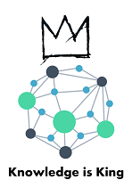

# KMAP (AMOS SS 2021)




Welcome to the KMAP repository. This repository contains the source code and the documentation of the KMAP project.  
This project is created in cooperation with the [CPU 24/7 GmbH](https://engineeringcloud.io/en/).

## Project vision
The contexmap for corporate data KMAP helps companies worldwide to automatically turn company data into valuable insights. By leveraging modular visualizations, we empower the corporate customers throughout the enterprise to find answers to business related questions without deeper coding knowledge. A responsive step-by-step exploration facilitates quick access to the insights needed. KMAP furthers the communication and transparency across companies and along the value-chain.  

## AMOS
This project was created as a university project and is part of the set of AMOS projects hosted by the [Professorship for Open Source Software](https://oss.cs.fau.de/) at the [University of Erlangen-Nuremberg](https://www.fau.eu/).

## Current development
Current development concentrates on creating a minimum viable product for KMAP. Core functionality will be integrating graph data bases, visualizing the graph data in a modular dashboard, and exploring the data with a no-code query builder.

## How to build
> :warning: **There is currently no common build system in place. Currently development focuses on this issue, which is tracked by [#37](https://github.com/amosproj/amos-ss2021-project2-context-map/issues/37) and [#60](https://github.com/amosproj/amos-ss2021-project2-context-map/issues/60).**  

### Prerequisites
1. Clone the repository via  
`git clone https://github.com/amosproj/amos-ss2021-project2-context-map.git`

1. Install node from [https://nodejs.org/en/](https://nodejs.org/en/).   
It is required to install node with version 12.x or higher.

1. Install `yarn` by running  
`npm i -g yarn`

### Run the project
> :warning: **Scripts are currently only available for windows platforms or platforms that have powershell installed**  

To start the project, navigate to the `/build` directory within the repository clone and run each of the scripts in the following order within a separate shell instance.
```
1. start-database.ps1
2. start-backend-dbg.ps1 
3. start-frontend-dbg.ps1
```

## Releases
There are currently no stable releases of the project.
